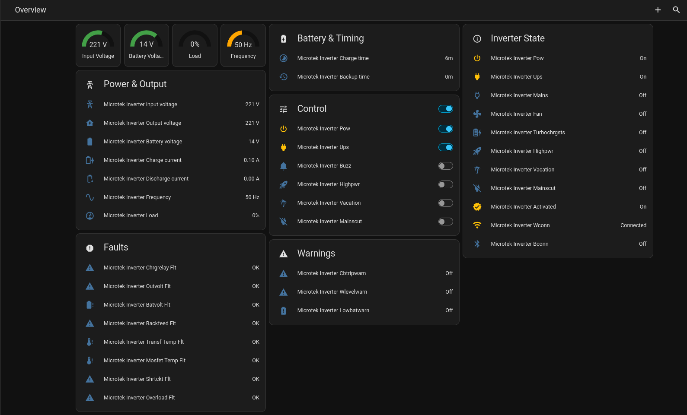

# Home Assistant Integration for Microtek Inverters

> [!IMPORTANT]
> This is an **unofficial, community** integration. It is a fan project and is not
> affiliated with or endorsed by Microtek.

*Integration for Microtek **`SEBZ`** hybrid battery/UPS inverters (WiFi-equipped).*

The integration talks **directly to the inverter** over its own WiFi module (AP
mode, `192.168.4.1`), giving fast updates **and** the ability to control it. The
Microtek cloud account is only used once during setup to discover the device and
fetch its per-device API token (`uat`); after that it is fully local.


## Features

- **Live sensors** — input/output/battery voltage, charge & discharge current,
  frequency, load %, WiFi signal (RSSI), charge & backup time, inverter mode,
  charge status, battery type, firmware versions.
- **Binary sensors** — mains present, UPS, fan, buzzer, WiFi/BT connection, and
  all fault/overload flags (low battery, overload, short circuit, over/under
  voltage, thermal, etc.).
- **Switches** — toggle inverter flags (UPS mode, buzzer, high power, vacation,
  mains cutoff, power on).
- **Select** — choose the inverter `mode`.

## Entities & units

All sensors are created under the inverter device with friendly names, so the
entity id is `<device_name>_<key>` (e.g. `sensor.microtek_inverter_involt` →
`sensor.microtek_inverter_input_voltage` with device name "Microtek Inverter").

| Entity | Field | Unit | Meaning |
|---|---|---|---|
| `involt` | sensor | V | grid input (mains) voltage |
| `outvolt` | sensor | V | output voltage |
| `batvolt` | sensor | V | battery DC voltage |
| `chrgcurr` | sensor | A | charge current (0.0 when not charging) |
| `dischrgcurr` | sensor | A | discharge current |
| `frequency` | sensor | Hz | grid frequency |
| `load` | sensor | % | load (0 when running from mains) |
| `chrgtime` | sensor | min | **minutes** until fully charged |
| `bkptime` | sensor | min | **minutes** of backup remaining |
| `rssi` | sensor | dBm | WiFi signal strength (disabled by default) |
| `mode` | sensor + select | – | inverter mode (sensor disabled by default; select always available) |
| `chrgsts` | sensor | – | charge status (disabled by default) |
| `battype` | sensor | – | battery type (disabled by default) |
| `mCoreVer` / `fv` / `flv` | sensor | – | firmware versions (disabled by default) |
| `pow`, `ups`, `mains`, `fan`, `buzz`, `highpwr`, `vacation`, `mainscut`, `turbochrgsts` | binary | – | 0/1 flags (on = 1) |
| `activated`, `wConn`, `bConn` | binary | – | connectivity state |
| `*_flt` / `*_warn` | binary | – | fault/overload flags (0 = none) |
| `ups`, `buzz`, `highpwr`, `vacation`, `mainscut`, `pow` | switch | – | toggle the corresponding flag via the inverter |
| `mode` | select | – | set inverter mode (0–8, disabled by default) |

## Tested on

- Microtek **Luxe 1400 WiFi** (product code `899-LT1-1400`, WiFi module, firmware `0007`)

## Installation

### Method 1: Using [HACS](https://hacs.xyz)

1. Open your Home Assistant UI.
2. Go to **HACS** → three dots (top right) → **Custom repositories**.
3. Under *Add custom repository*, enter:
   - **URL:** `https://github.com/coder3101/ha-microtek-inverter`
   - **Category:** Integration
4. Click **Add**.
5. Search for **Microtek** in HACS and select it.
6. Click **Install** and follow the prompts.

### Method 2: Manual Installation

1. Open the folder that holds your HA configuration (`configuration.yaml`).
2. Create a `custom_components` folder if it does not exist.
3. Create a folder called `microtek` inside it.
4. Download all files from `custom_components/microtek/` from this repository.
5. Place them in that folder.
6. Restart Home Assistant.

## Configuration

1. Open **Settings → Devices & Services → + Add Integration → Microtek Inverter**.
2. Enter your vendor app credentials:
   - **Username:** phone number used with the app.
   - **Password:** the app password.
   - **Country code:** e.g. `+91` (used for the phone number).
3. Select your **home**, then your **device**.
4. Optionally adjust the **AP host** and **AP port** (defaults `192.168.4.1:80`).
5. Done — sensor entities appear under the inverter device.

The polling interval can be changed in the integration's **Options** (default 15 s).

## Network requirements (AP mode)

For the integration to reach the inverter, **Home Assistant must be able to
reach `192.168.4.1`**:

- **Recommended:** set the HA host to the inverter's own Wi-Fi **AP** network
  (`MD-SEBZ-<udid>`), where the gateway is `192.168.4.1`. Note this typically
  disconnects your HA from your normal Wi-Fi unless it has multiple NICs.
- **Alternative:** connect the inverter to your normal Wi-Fi LAN (it can act as
  a station too), then point the integration at the inverter's LAN IP instead of
  `192.168.4.1`.
- **Not supported:** reaching the inverter while HA is on a different network
  with no route to the device. Use the vendor app in that case.

## Data source

The live state is polled directly from the inverter via `GET /gds?uat=<token>`
and writes go through `POST /sds` (see the
[protocol documentation](https://github.com/coder3101/microtek-inverter-protocol)).
The token (`uat`) and device details are fetched once from the Microtek cloud
`/prod/things` endpoint during setup; the integration then runs fully local.

> Use the cloud API only with accounts/devices you own. Third-party access may
> violate the manufacturer's terms of service.

## Caveats

- The integration polls the inverter over its AP interface (`local_polling`);
  sensor updates appear at the configured interval, not in real time.
- **Requires HA to reach `192.168.4.1`** (or the configured LAN IP). If the
  inverter AP is not reachable, sensors go unavailable.
- The `mode` select values are not officially documented; options are 0–8
  labelled generically. Some devices reject certain switches/values — those
  writes log an error and are reverted.
- The `pow` switch turns the inverter output on/off. Handle with care.

## Logs

Enable debug logging in Home Assistant:

```yaml
logger:
  default: warning
  logs:
    custom_components.microtek: debug
```

## Example dashboard

A ready-to-use Lovelace dashboard (gauge cards for voltage, load, frequency,
switches + mode select for control) and clock/timer template sensors for charge
& backup time live in [`examples/`](examples/):

- `examples/microtek_dashboard.yaml` — import via **Settings → Dashboards → … → Import file**
- `examples/microtek_template_sensors.yaml` — merge under `template:` in `configuration.yaml`

Entity ids in the example assume your device is named **Microtek Inverter**
(`sensor.microtek_inverter_*`); adjust if yours differ.



## License

Apache-2.0
